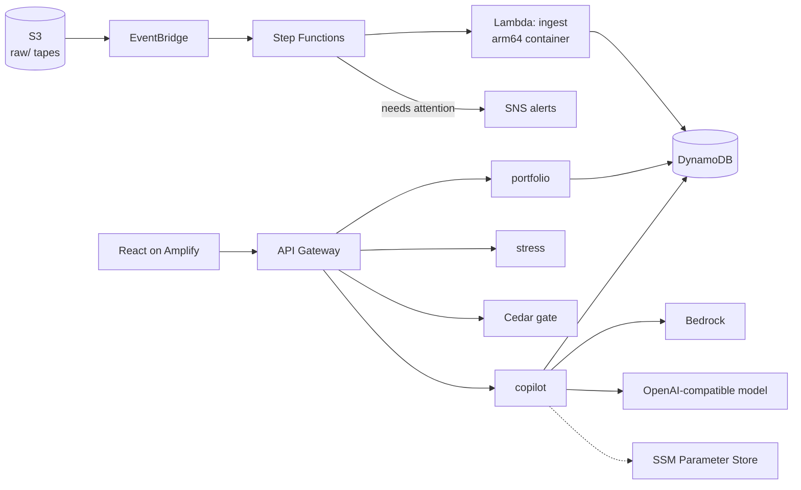

# LoanLens

[](https://github.com/ac265640/LoanLens/actions/workflows/ci.yml)
[](LICENSE)


**Every loan scored, not just a sample.** LoanLens takes a monthly loan tape, scores every loan for default, delinquency
and prepayment risk, flags records that contradict themselves, stress-tests the portfolio, and gates approvals with
policy-as-code. It runs entirely on serverless AWS and was built for the WeMakeDevs x AWS *First Commit* hackathon.

- **Live app:** https://main.d3uibhd8oe3ebl.amplifyapp.com (landing page; the dashboard is at `/dashboard`)
- **API:** `https://kwazm9gei8.execute-api.us-east-1.amazonaws.com/prod` (try `GET /loans`; see [docs/api.md](docs/api.md))

## The problem

Every month a lender receives a loan tape: one row per loan per month, often tens of thousands of rows. Reviewing all of
it by hand is impractical, so review usually covers a sample, and whatever the sample misses goes unseen until it becomes a
loss: a borrower about to stop paying, a paid-off loan that still shows a balance, a portfolio that would not survive a rate
shock. LoanLens reviews all of it the moment the file lands.

## What it does

| | |
|---|---|
| **Scores every loan** | Four calibrated LightGBM probabilities (3-month and 6-month delinquency, 12-month default, 12-month prepayment) plus a next-month status prediction |
| **Finds bad records** | An Isolation Forest combined with five deterministic validation rules (VR001-VR005) flags loans that need human review, and why |
| **Governs approvals** | Approval and override rights are [Cedar](https://www.cedarpolicy.com/) policies evaluated by the official engine, so a junior underwriter cannot approve what a policy forbids |
| **Stress-tests live** | Sliders for an interest-rate and an unemployment shock return expected loss, capital impact and VaR immediately, with an explanation of what changed |
| **Explains itself** | A reviewer copilot writes loan memos and answers portfolio questions from the scored data only, and always says which model answered |
| **Proves coverage** | The dashboard compares full coverage with what a random 5% manual sample would be expected to see, computed from the live portfolio |
| **Alerts you** | When a tape contains high-risk loans or exceptions, Step Functions publishes an SNS alert |

Try it: open `/dashboard`, drop [`data/sample/demo_loan_tape.csv`](data/sample/demo_loan_tape.csv) on the upload area, open the
**High Risk** tab, click a loan, and run the Cedar gate as each role. The 41%-risk loan is denied to a Junior Underwriter and
allowed for a Senior; on an exception loan only the Risk Committee may `OverrideAnomaly`.

## Architecture



Uploading a file is the only trigger. It lands in S3, EventBridge starts a Step Functions run, a container Lambda scores the
whole tape into DynamoDB, and the dashboard picks up the result. Nothing runs when nobody is using it: no EC2, no SageMaker
endpoint, no OpenSearch. Full walkthrough in [docs/architecture.md](docs/architecture.md).

**AWS services:** S3, EventBridge, Step Functions, Lambda (container image and zip), DynamoDB, API Gateway, SNS, SSM Parameter
Store, Bedrock, Amplify Hosting, CloudWatch Logs. Infrastructure is one SAM template
([`infra/template.yaml`](infra/template.yaml)).

## The copilot and Bedrock

The copilot builds its facts first (whole-portfolio aggregates, the top loans by risk, every exception) and only then asks a
model to explain them. It tries **Amazon Bedrock** first, then any **OpenAI-compatible** model whose endpoint and key live in
SSM Parameter Store, then a **deterministic template** built from the same facts. The response always states which one answered
and why the others did not, so a template answer is never presented as model output.

Bedrock access depends on your AWS account passing Bedrock's account verification. To use a free model instead:

```bash
scripts/configure_llm.sh groq      # or gemini | openai | custom
```

The key is read with a hidden prompt, validated with real requests, stored as an SSM SecureString, and never appears on a
command line. No redeploy is needed. Details in [docs/deployment.md](docs/deployment.md).

## Repository structure

```
backend/
  ingest_pipeline/   scoring Lambda (arm64 container): handler, feature engineering, rules, trained models
  copilot/           reviewer copilot Lambda: provider chain, grounding, deterministic answers
  cedar_gate/        Cedar policy gate Lambda, the .cedar policies, and their tests
  portfolio_api/     portfolio read API and presigned upload URLs
  stress_query/      stress Lambda and the precomputed response grid
frontend/            React + Vite + Tailwind: landing page, architecture page, dashboard
infra/               SAM template, Step Functions definition, deploy config
training/            data generation, model training and analysis scripts
scripts/             demo tape builder, stress grid, frontend deploy, LLM configuration
tests/               pytest suite
data/                data dictionary, macro scenarios, the sample tape
docs/                architecture, API reference, ML pipeline, deployment
.github/workflows/   CI
```

## Getting started

**Run the frontend against the live API (no AWS account needed):**

```bash
cd frontend && cp .env.example .env && npm ci && npm run dev    # http://localhost:5173
```

**Run every test:**

```bash
make setup && make test cedar-test       # 72 pytest tests + 8 Cedar authorization tests
```

**Retrain everything from scratch** (about two minutes): `make run-all`.

**Deploy your own copy:** `make deploy-backend && make deploy-frontend`. See [docs/deployment.md](docs/deployment.md), which also
covers alerts, teardown and troubleshooting.

## Quality

CI runs the Python tests, the Cedar policy tests, the frontend type-check and build, and a SAM template lint on every push.
The tests exercise the real handlers against fakes for DynamoDB, SSM and the model provider, and include regressions for bugs
found in production, such as the DynamoDB float/NaN write failure and a copilot grounded on the wrong slice of the portfolio.

## Data and models

All data is synthetic, and every model in [`backend/ingest_pipeline/models/`](backend/ingest_pipeline/models) is trained by the
scripts in [`training/`](training). Headline results on a held-out validation cohort: ROC-AUC 0.81 for 3-month delinquency, 0.76
for 6-month, 0.68 for 12-month default; probabilities are calibrated (ECE 0.017, measured on the cohort the calibrator was fitted
on); conformal 90% intervals cover 90.3%; and a competing-risk analysis shows the naive single-risk estimate overstating 36-month
default by 1.46 points. Methods, caveats and the full tables are in [docs/ml-pipeline.md](docs/ml-pipeline.md).

## What we learned

- **Cedar has no floating point.** Policies compare integers, so risk and LTV travel as integer percentages. The `cedar-policy`
  package on PyPI is an unrelated placeholder; the official engine is the npm package `@cedar-policy/cedar-wasm`, which runs
  inside Lambda.
- **The Python 3.11 Lambda image is Amazon Linux 2 (old glibc).** Current scipy and LightGBM wheels would not install, so pip tried
  to compile from source. The Python 3.12 image (Amazon Linux 2023) fixed it.
- **DynamoDB rejects Python floats and NaN.** Our first live run failed on this. We reproduced it locally with boto3's own
  serializer and kept it as a regression test.
- **A silent fallback hides failures.** The copilot first swapped in a template when Bedrock failed, which would have looked like
  model output. It now labels every answer, and reports why each provider was skipped.
- **A tape is a snapshot, not a log.** Replacing the portfolio on each upload, and building the demo tape as an as-of snapshot,
  made the totals and the demo realistic.
- **Retry the transient, never the deterministic.** Step Functions retries only Lambda service errors; a malformed upload fails once
  with a message that names the missing columns.
- **Bedrock is gated by account verification.** Designing the copilot as a provider chain, rather than a hard dependency, meant
  the product kept working while that was resolved.
- **Tooling can fail in ways that look like your code.** A blocked macOS credential helper made every SAM build hang silently; the
  fix and diagnosis are in [docs/deployment.md](docs/deployment.md).

## Known limitations

- The API has no authentication. It is a demo deployment over synthetic data, so every endpoint, including tape upload, is open.
  It is throttled to 20 requests per second.
- The copilot can be wrong, as any language model can. It sees only the scored portfolio, and its answers should be checked
  against the table.
- Expected loss uses an illustrative 35% LGD, capital impact an illustrative capital base, and VaR a z-score approximation
  rather than a Monte Carlo run. The UI says so next to the numbers.
- Models are trained on a 5,000-loan synthetic portfolio, so absolute AUCs are modest and the per-state fairness audit is noisy.
  Metrics show how the pipeline behaves, not how it would perform on a real lender's book.
- Larger tapes have not been load-tested. The demo tape (395 loans, 4,948 records) scores in seconds; the ingest Lambda has 1.5 GB
  and a 2-minute limit.
- Scale to zero means the first request after a quiet period waits for a Lambda cold start.

## Team

- **Amit Chauhan** ([@ac265640](https://github.com/ac265640)): ML pipeline, AWS architecture and backend, deployment
- **Abhishek Singh**: frontend design and implementation (landing page, architecture page, theming, copilot interface)

## AI tools

Claude Code (Anthropic) was used for architecture, the AWS integration, the analysis scripts, tests and debugging.

## Credits and licence

The credit-risk modelling approach (feature set, target definitions, calibration method, the VR001-VR005 rule definitions) builds on
the authors' own earlier project. During this hackathon the data generator, every model, the analysis layer, the whole AWS
deployment, Cedar governance, the copilot, the stress simulator and the frontend were built in this repository; see the commit
history. Third-party libraries keep their own licences. LoanLens is released under the [MIT License](LICENSE).
