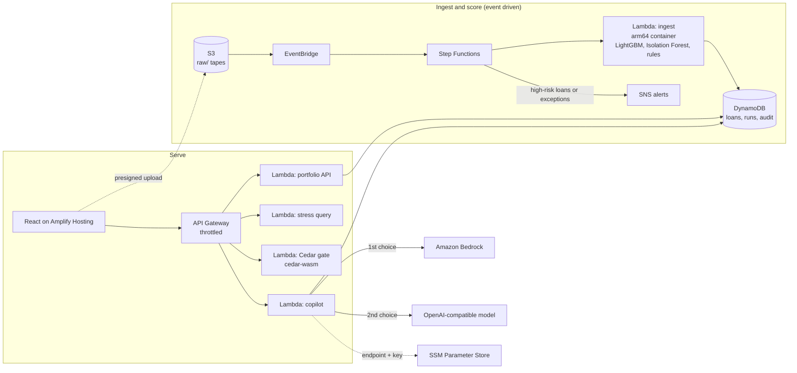

# Architecture

LoanLens is serverless end to end. Nothing runs when nobody is using it: there is no EC2, no SageMaker
endpoint and no OpenSearch domain, so idle cost is close to zero.

## Flow 1: a tape becomes a scored portfolio

1. The dashboard asks `POST /upload-url` for a presigned S3 URL and uploads the CSV straight to S3.
   The file never passes through API Gateway, so its 10 MB payload limit does not apply. The practical limit is
   the ingest Lambda (1.5 GB, 2 minutes): the demo tape (395 loans, 4,948 monthly records) scores in a few seconds, but
   larger tapes have not been load-tested.
2. S3 emits an *Object Created* event to EventBridge. A rule matching the `raw/` prefix starts the state machine.
3. **Step Functions** invokes the ingest Lambda. It retries only Lambda *service* errors
   (`Lambda.ServiceException`, `TooManyRequestsException`, and so on). A bad tape is a deterministic
   failure and fails once.
4. The **ingest Lambda** validates the columns, engineers the 32 features, runs the four calibrated
   LightGBM probability models, the next-state classifier, the Isolation Forest and the VR001-VR005
   rules, and writes one item per loan to DynamoDB.
5. A tape is a *snapshot*: after writing, loans that were in an earlier tape but not this one are removed,
   so totals never include loans that have left the portfolio.
6. A run record (`COMPLETE` with counts, or `FAILED` with the error) is written to the runs table. The
   dashboard polls it.
7. A **Choice** state checks the counts. If any loan is high risk or has an exception, Step Functions
   publishes to **SNS** using its native SDK integration (no extra Lambda).

## Flow 2: the reviewer copilot

`POST /copilot` supports three modes: a credit memo for one loan, a question about the portfolio, and a
plain-English reading of a stress scenario.

The facts are assembled first and are the only thing the model sees. A portfolio question is answered from
aggregates computed over **every** scored loan: totals, status mix, per-credit-band averages, the top loans
by risk and all exceptions. Providers are then tried in order:

| # | Provider | When it answers |
|---|---|---|
| 1 | Amazon Bedrock (Converse API) | The account has Bedrock access. After a refusal it is skipped for 5 minutes so requests don't wait on a call known to fail. |
| 2 | Any OpenAI-compatible endpoint | An API key is configured. Endpoint, model and key live in SSM Parameter Store under `/loanlens/llm/` (key as SecureString). |
| 3 | Deterministic template | Always available. Built from the same facts, and always labelled as a template. |

Every response says which provider answered, or why the others did not. Every call is audit-logged to
DynamoDB with the context, prompt, output, provider and failure reasons.

## Flow 3: governance with Cedar

The dashboard sends the acting role, the action and the loan to `POST /cedar/authorize`. A Node.js Lambda
evaluates [`backend/cedar_gate/policies/underwriting.cedar`](../backend/cedar_gate/policies/underwriting.cedar)
with the official `@cedar-policy/cedar-wasm` engine and returns the decision and the policy that decided it.

Cedar has no floating point, so policies compare integer percentages: risk is the 12-month default
probability x 100, and LTV is the upper bound of the loan's LTV band.

| Role | ApproveLoan | OverrideAnomaly |
|---|---|---|
| Junior Underwriter | risk <= 25%, LTV <= 80%, amount <= $2.5M | never |
| Senior Underwriter | risk <= 50%, LTV <= 90% | never |
| Risk Committee | any loan | always |

Only the Risk Committee is ever permitted to override. On top of that default deny, an explicit `forbid` policy states the fraud guardrail: nobody except the Risk Committee may override an exception-flagged loan.
`backend/cedar_gate/test_policies.mjs` runs eight authorization scenarios.

## AWS services

| Service | Role |
|---|---|
| S3 | Tape uploads (presigned); `raw/` objects expire after 7 days |
| EventBridge | Routes the S3 event to Step Functions |
| Step Functions | Orchestration, retries for transient errors, alert branching |
| Lambda | Ingest (arm64 container, Python 3.12), portfolio API, stress query, copilot (Python), Cedar gate (Node.js 22) |
| DynamoDB | `loanlens-loans`, `loanlens-runs`, `loanlens-copilot-audit` (on-demand) |
| API Gateway | REST API, stage throttled to 20 requests/s (burst 40) |
| SNS | Alerts when a run finds loans that need attention |
| SSM Parameter Store | Copilot fallback model settings and API key (SecureString) |
| Bedrock | First-choice model for the copilot |
| Amplify Hosting | The React dashboard, with an SPA rewrite for client-side routes |
| CloudWatch Logs | One log group per function, 7-day retention |

## Design decisions

- **Scale to zero.** Cost tracks usage. This matters on a hackathon credit budget and is also the right shape
  for a workload that arrives as a monthly file.
- **Event driven, not polled.** Uploading a file is the only trigger.
- **The model never predicts.** All numbers come from the trained models and rules. The copilot only
  explains them, and the disclaimer *Recommendation, not a decision* is appended to every answer.
- **Failures are visible.** A failed run is recorded and shown, a template answer is labelled, a
  stale stress figure says so, and an unreachable API shows a retry banner. Nothing fails silently.
- **Secrets stay out of the repo.** The only secret is the optional fallback-model key, held in SSM as a
  SecureString and never on a command line (see `scripts/configure_llm.sh`).

## What is not here, on purpose

The API has no authentication, because this is a demo over synthetic data. Cognito would be the next step.
There is no vector store: the copilot's context is computed directly from DynamoDB, which is exact
for a portfolio this size. See [Known limitations](../README.md#known-limitations).
